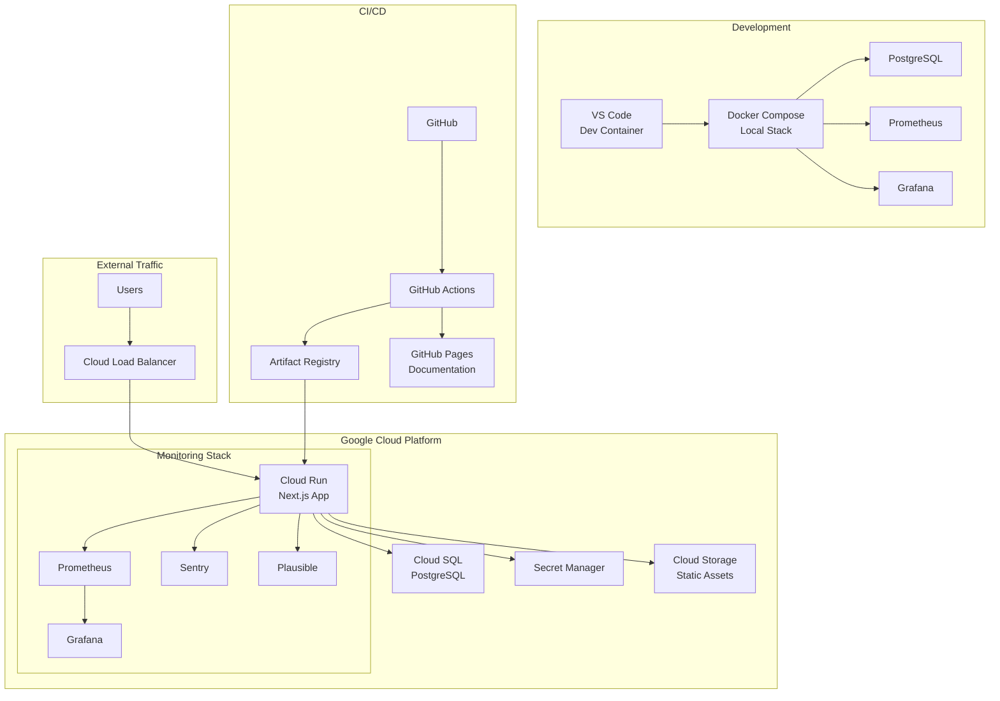
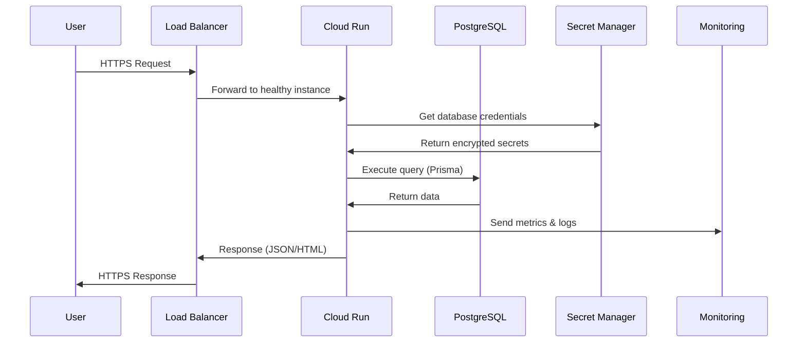
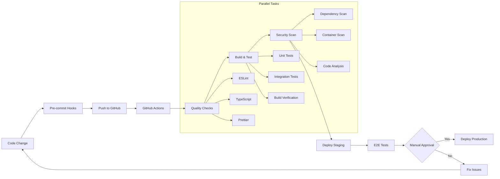

# System Architecture Overview

This document provides a high-level overview of the RK Website Core architecture, design decisions, and system components.

## Architecture Philosophy

The system is designed around **container-first development**, **type safety**, and **documentation-driven development**:

- **Container-First**: Dev = CI = Prod environments using Docker
- **Type Safety**: TypeScript strict mode throughout the stack
- **Documentation-Driven**: Every decision documented and auto-published
- **Security by Default**: Built-in security measures and automated scanning
- **Observability**: Comprehensive monitoring from day one

## System Overview



## Technology Stack

### Core Application Layer

| Component          | Technology     | Purpose              | Rationale                                           |
| ------------------ | -------------- | -------------------- | --------------------------------------------------- |
| **Runtime**        | Node.js 20     | JavaScript runtime   | Latest LTS, excellent performance, ecosystem        |
| **Framework**      | Next.js 14+    | React meta-framework | App Router, SSR/SSG, API routes, optimization       |
| **Language**       | TypeScript     | Programming language | Type safety, better DX, self-documenting            |
| **Database**       | PostgreSQL 14+ | Primary database     | ACID compliance, JSON support, mature ecosystem     |
| **ORM**            | Prisma         | Database access      | Type-safe queries, migration system, great DX       |
| **Styling**        | Tailwind CSS   | CSS framework        | Utility-first, no runtime, design system            |
| **Authentication** | Auth.js v5     | User authentication  | Next.js native, secure defaults, multiple providers |

### Infrastructure Layer

| Component             | Technology            | Purpose               | Rationale                                         |
| --------------------- | --------------------- | --------------------- | ------------------------------------------------- |
| **Container Runtime** | Docker                | Containerization      | Consistent environments, easy deployment          |
| **Orchestration**     | docker-compose        | Local development     | Simple multi-service setup                        |
| **Cloud Platform**    | Google Cloud Platform | Production hosting    | Managed services, good pricing, reliability       |
| **Compute**           | Cloud Run             | Serverless containers | Auto-scaling, pay-per-use, zero-downtime deploys  |
| **Database Hosting**  | Cloud SQL             | Managed PostgreSQL    | Automatic backups, high availability, security    |
| **CDN/Load Balancer** | Cloud Load Balancer   | Traffic distribution  | Global, HTTPS termination, DDoS protection        |
| **Secrets**           | Secret Manager        | Credential management | Encrypted storage, automatic rotation, audit logs |
| **Static Assets**     | Cloud Storage         | File storage          | CDN integration, versioning, cost-effective       |

### Development & DevOps

| Component              | Technology                   | Purpose                 | Rationale                              |
| ---------------------- | ---------------------------- | ----------------------- | -------------------------------------- |
| **IaC**                | Terraform                    | Infrastructure as Code  | Multi-cloud, mature, great ecosystem   |
| **CI/CD**              | GitHub Actions               | Automation pipeline     | GitHub native, flexible, matrix builds |
| **Container Registry** | Artifact Registry            | Image storage           | GCP native, vulnerability scanning     |
| **Quality Gates**      | ESLint, Prettier, TypeScript | Code quality            | Industry standard, configurable        |
| **Testing**            | Vitest, Playwright           | Test automation         | Fast, modern, reliable                 |
| **Security Scanning**  | Snyk, Trivy, CodeQL          | Vulnerability detection | Multiple layers, automated             |

### Monitoring & Observability

| Component                  | Technology           | Purpose                   | Cost Model                 |
| -------------------------- | -------------------- | ------------------------- | -------------------------- |
| **Infrastructure Metrics** | GCP Cloud Monitoring | System monitoring         | Pay-per-use, free tier     |
| **Application Metrics**    | Prometheus           | Custom metrics            | Self-hosted, free          |
| **Dashboards**             | Grafana              | Visualization             | Self-hosted, free          |
| **Error Tracking**         | Sentry               | Application errors        | Free tier: 5k errors/month |
| **User Analytics**         | Plausible            | Privacy-focused analytics | Self-hosted or $9/month    |
| **Distributed Tracing**    | OpenTelemetry        | Request tracing           | Free (storage costs only)  |

## Architecture Patterns

### 1. Container-First Development

**Problem**: Environment inconsistencies, complex setup, "works on my machine"

**Solution**: Everything runs in containers from day one

```dockerfile
# Multi-stage Dockerfile for optimization
FROM node:20-alpine AS deps
WORKDIR /app
COPY package*.json ./
RUN npm ci --only=production

FROM node:20-alpine AS builder
WORKDIR /app
COPY . .
RUN npm run build

FROM node:20-alpine AS runtime
WORKDIR /app
COPY --from=deps /app/node_modules ./node_modules
COPY --from=builder /app/.next ./.next
CMD ["npm", "start"]
```

**Benefits**:

- Identical dev/CI/prod environments
- Fast onboarding (one command setup)
- Easy cleanup and reset
- Monitoring stack included locally

### 2. Type-Safe Full Stack

**Problem**: Runtime errors, API contract mismatches, poor developer experience

**Solution**: End-to-end type safety with TypeScript and Prisma

```typescript
// Database schema defines types
model User {
  id    String @id @default(cuid())
  email String @unique
  posts Post[]
}

// Auto-generated types
import type { User } from '@prisma/client'

// API route with validation
const CreateUserSchema = z.object({
  email: z.string().email(),
})

export async function POST(req: NextRequest) {
  const { email } = CreateUserSchema.parse(await req.json())
  const user = await db.user.create({ data: { email } })
  return NextResponse.json(user) // Fully typed response
}
```

### 3. Documentation-Driven Development

**Problem**: Outdated docs, architectural drift, poor knowledge transfer

**Solution**: Documentation as code with automatic publishing

- All architecture decisions documented
- Auto-generated API documentation
- Documentation updated with every feature
- Living documentation with version control

### 4. Security by Default

**Problem**: Security as an afterthought, vulnerability accumulation

**Solution**: Security baked into every layer

- **Input validation**: Zod schemas for all inputs
- **SQL injection**: Prevented by Prisma ORM
- **XSS**: React escapes by default
- **CSRF**: Next.js middleware protection
- **Secrets**: Never in code, Secret Manager only
- **Dependencies**: Automated vulnerability scanning
- **Infrastructure**: Least privilege, VPC isolation

## Data Flow Architecture

### Request Lifecycle



### Development Workflow



## Scalability Considerations

### Horizontal Scaling

- **Cloud Run**: Automatic scaling 0-1000 instances
- **Database**: Connection pooling, read replicas if needed
- **Static Assets**: Global CDN distribution
- **Load Balancer**: Global Anycast IPs

### Performance Optimization

- **Next.js**: Automatic code splitting, image optimization
- **Database**: Prisma connection pooling, query optimization
- **Caching**: Redis for session storage (future enhancement)
- **Monitoring**: Performance budgets in CI/CD

### Cost Optimization

- **Serverless**: Pay only for actual usage
- **Container**: Scale to zero when not in use
- **Database**: Right-sized instances, automated scaling
- **Monitoring**: Self-hosted where possible

## Security Architecture

### Defense in Depth

1. **Network Layer**

   - VPC with private subnets
   - Cloud Armor DDoS protection
   - HTTPS everywhere with automatic SSL

2. **Application Layer**

   - Input validation (Zod schemas)
   - Output encoding (React default)
   - Authentication (Auth.js)
   - Authorization (role-based)

3. **Data Layer**

   - Encrypted at rest and in transit
   - Parameterized queries (Prisma)
   - Backup encryption
   - Access logging

4. **Infrastructure Layer**
   - Least privilege IAM
   - Secret Manager for credentials
   - Container vulnerability scanning
   - Infrastructure as Code audit trail

## Monitoring & Observability

### Three Pillars Implementation

1. **Metrics** (Prometheus + Grafana)

   - Application performance metrics
   - Business KPI tracking
   - Infrastructure monitoring
   - Custom dashboards

2. **Logs** (Cloud Logging + structured logging)

   - Application logs with correlation IDs
   - Audit logs for security events
   - Error logs with stack traces
   - Performance logs

3. **Traces** (OpenTelemetry)
   - Request flow across services
   - Database query performance
   - External API call tracking
   - Performance bottleneck identification

### Alerting Strategy

- **Critical**: Production down, database issues
- **Warning**: High error rates, performance degradation
- **Info**: Deployment notifications, scaling events

---

::: tip Architecture Evolution
This architecture is designed to evolve incrementally. Start simple, measure everything, and optimize based on real data and usage patterns.
:::
