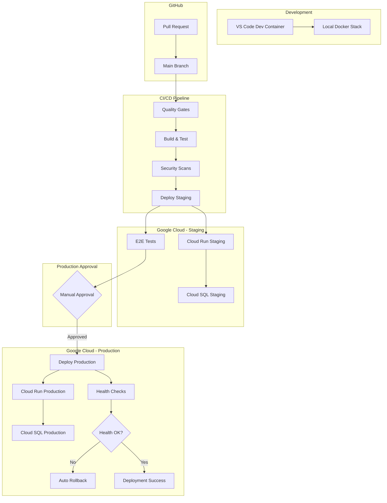

# Deployment Process

This guide covers the complete deployment workflow for the RK Website Core project, from local development to production.

## Deployment Architecture

### Environment Overview



## Environment Configuration

### Development Environment

**Purpose**: Local development, feature building, debugging
**Cost**: $0 (local containers)

```bash
# Start local development stack
docker-compose up -d postgres prometheus grafana
pnpm dev

# Available services:
# - Next.js App: http://localhost:3000
# - PostgreSQL: localhost:5432
# - Prometheus: http://localhost:9090
# - Grafana: http://localhost:3001
```

**Features**:

- Hot reload for instant feedback
- Local database with seed data
- Full monitoring stack
- Isolated environment for safe experimentation

### Staging Environment

**Purpose**: Integration testing, stakeholder preview, pre-production validation
**Trigger**: Automatic deployment on merge to `main`
**Cost**: ~$20-30/month

**Infrastructure**:

- **Cloud Run**: Auto-scaling serverless containers
- **Cloud SQL**: db-f1-micro (1 vCPU, 0.6GB RAM)
- **Domain**: `staging.your-domain.com`
- **Database**: Subset of production data (anonymized)
- **Monitoring**: Same stack as production, separate workspace

**Deployment Process**:

1. Merge PR to `main` branch
2. GitHub Actions triggered automatically
3. Quality gates pass (lint, test, security)
4. Container built and pushed to Artifact Registry
5. Deploy to Cloud Run staging
6. Run smoke tests and E2E tests
7. Notify team of successful deployment

### Production Environment

**Purpose**: Real users, business metrics, revenue generation
**Trigger**: Manual approval after staging validation
**Cost**: ~$100-200/month (scales with usage)

**Infrastructure**:

- **Cloud Run**: Auto-scaling with higher limits
- **Cloud SQL**: db-n1-standard-2 (2 vCPU, 7.5GB RAM)
- **Domain**: `your-domain.com`
- **Database**: Production data with automated backups
- **Monitoring**: Full alerting with PagerDuty integration

**Deployment Process**:

1. Staging deployment succeeds
2. Manual approval required (GitHub UI)
3. Canary deployment to 10% of traffic
4. Monitor health metrics for 10 minutes
5. Gradually increase traffic to 100%
6. Full health check validation
7. Rollback automatically if issues detected

## Deployment Workflows

### GitHub Actions Pipeline

#### Quality Gates (Parallel Execution)

```yaml
jobs:
  quality-gates:
    strategy:
      matrix:
        checks: [eslint, prettier, typescript, audit, snyk, trivy]
    steps:
      - name: Run ${{ matrix.checks }}
        run: pnpm run ${{ matrix.checks }}
```

**Checks Include**:

- **ESLint**: Code quality and pattern enforcement
- **Prettier**: Code formatting consistency
- **TypeScript**: Type checking and compilation
- **npm audit**: Dependency vulnerability scanning
- **Snyk**: Advanced security vulnerability detection
- **Trivy**: Container and IaC security scanning

#### Build & Test Pipeline

```yaml
jobs:
  build-and-test:
    needs: quality-gates
    steps:
      - name: Unit Tests
        run: pnpm test
      - name: Integration Tests
        run: pnpm test:integration
      - name: Build Application
        run: pnpm build
      - name: Build Container
        run: docker build -t app:${{ github.sha }} .
```

#### Deployment Pipeline

```yaml
jobs:
  deploy-staging:
    needs: build-and-test
    if: github.ref == 'refs/heads/main'
    steps:
      - name: Deploy to Cloud Run
        run: |
          gcloud run deploy staging-app \
            --image gcr.io/project/app:${{ github.sha }} \
            --region us-central1 \
            --allow-unauthenticated

  deploy-production:
    needs: deploy-staging
    if: github.event_name == 'workflow_dispatch'
    environment: production
    steps:
      - name: Canary Deployment
        run: |
          # Deploy to production with traffic splitting
          gcloud run deploy prod-app \
            --image gcr.io/project/app:${{ github.sha }} \
            --region us-central1 \
            --traffic latest=10
```

## Database Deployment Strategy

### Forward-Compatible Migrations

**Principle**: Always make additive changes first, then remove deprecated features

**Safe Migration Pattern**:

```sql
-- Step 1: Add new nullable column
ALTER TABLE users ADD COLUMN profile_image_url TEXT;

-- Deploy application code that handles both states

-- Step 2: Backfill data (if needed)
UPDATE users SET profile_image_url = 'default.jpg'
WHERE profile_image_url IS NULL;

-- Step 3: Make required (in later migration)
ALTER TABLE users ALTER COLUMN profile_image_url SET NOT NULL;
```

**Unsafe Operations** (avoid in production):

- Dropping columns immediately
- Renaming columns
- Changing column types
- Adding NOT NULL constraints without defaults

### Migration Workflow

```bash
# Development
pnpm prisma migrate dev --name add-user-profiles

# Staging (automatic)
pnpm prisma migrate deploy

# Production (automatic with approval)
pnpm prisma migrate deploy
```

### Database Backup Strategy

**Staging**:

- Point-in-time recovery: 7 days
- Automated backups: Daily at 2 AM UTC
- Cross-region backup: Not required

**Production**:

- Point-in-time recovery: 30 days
- Automated backups: Daily at 2 AM UTC
- Cross-region backup: Enabled (us-east1)
- Read replicas: 1 for reporting queries

## Container Deployment

### Multi-Stage Dockerfile Strategy

```dockerfile
# Stage 1: Dependencies (cached for faster builds)
FROM node:20-alpine AS deps
WORKDIR /app
COPY package*.json pnpm-lock.yaml ./
RUN npm install -g pnpm && pnpm install --frozen-lockfile

# Stage 2: Build application
FROM node:20-alpine AS builder
WORKDIR /app
COPY --from=deps /app/node_modules ./node_modules
COPY . .
RUN pnpm prisma generate
RUN pnpm build

# Stage 3: Production runtime (minimal size)
FROM node:20-alpine AS runner
WORKDIR /app
RUN addgroup --system --gid 1001 nodejs
RUN adduser --system --uid 1001 nextjs

# Copy built application
COPY --from=builder /app/public ./public
COPY --from=builder --chown=nextjs:nodejs /app/.next/standalone ./
COPY --from=builder --chown=nextjs:nodejs /app/.next/static ./.next/static

USER nextjs
EXPOSE 3000
ENV PORT 3000
CMD ["node", "server.js"]
```

### Container Security

**Security Measures**:

- Non-root user execution
- Minimal base image (Alpine Linux)
- Multi-stage builds (smaller attack surface)
- Vulnerability scanning with Trivy
- Signed container images

**Build Optimizations**:

- Layer caching for faster builds
- .dockerignore for smaller context
- Dependency caching between builds
- Optimized for Cloud Run deployment

## Health Checks & Monitoring

### Health Check Endpoint

```typescript
// src/app/api/health/route.ts
export async function GET() {
  const startTime = Date.now();

  try {
    // Database connectivity check
    await db.$queryRaw`SELECT 1`;

    // External service checks (if applicable)
    const externalChecks = await Promise.allSettled([
      // Add external service health checks here
    ]);

    const responseTime = Date.now() - startTime;

    return Response.json({
      status: "healthy",
      timestamp: new Date().toISOString(),
      responseTime: `${responseTime}ms`,
      checks: {
        database: "connected",
        external: externalChecks.length > 0 ? "checked" : "none",
      },
    });
  } catch (error) {
    return Response.json(
      {
        status: "unhealthy",
        timestamp: new Date().toISOString(),
        error: error instanceof Error ? error.message : "Unknown error",
      },
      { status: 503 }
    );
  }
}
```

### Deployment Monitoring

**Key Metrics to Track**:

- Deployment duration
- Error rate during deployment
- Response time regression
- Container startup time
- Database migration duration

**Automated Alerts**:

- Error rate > 1% (triggers auto-rollback)
- Response time > 2x baseline
- Health check failures
- Container restart loops

## Rollback Procedures

### Automatic Rollback Triggers

**Production**:

- Health check failures for 2+ minutes
- Error rate exceeds 1% for 5+ minutes
- Response time exceeds 5 seconds for 3+ minutes

**Rollback Process**:

```bash
# Automatic rollback to previous revision
gcloud run services update prod-app \
  --to-revisions=PREVIOUS=100 \
  --region=us-central1
```

### Manual Rollback

```bash
# List recent revisions
gcloud run revisions list --service=prod-app

# Rollback to specific revision
gcloud run services update prod-app \
  --to-revisions=prod-app-00005-abc=100 \
  --region=us-central1
```

### Database Rollback

**Forward-Only Strategy**: Database changes are forward-compatible only

- Point-in-time recovery for data corruption
- Application-level feature flags for feature rollbacks
- Schema rollbacks require manual intervention

## Feature Flag Deployment (Future Enhancement)

### Gradual Feature Rollouts

```typescript
// Feature flag usage in components
const useNewDashboard = await featureFlag("new-dashboard", {
  user: session.user,
  rolloutPercentage: 25,
  rules: {
    beta_users: true,
    admin: true,
  },
});

return useNewDashboard ? <NewDashboard /> : <LegacyDashboard />;
```

### Deployment with Feature Flags

1. **Deploy with flag disabled** (0% rollout)
2. **Enable for internal users** (beta_users: true)
3. **Gradual rollout** (5% → 25% → 50% → 100%)
4. **Monitor metrics** at each step
5. **Emergency disable** if issues detected

## Security Considerations

### Secrets Management

**Development**: `.env.local` (git-ignored)
**Staging**: Google Secret Manager (staging project)
**Production**: Google Secret Manager (production project)

**Secret Rotation**:

- Database passwords: Quarterly
- API keys: As needed
- JWT signing keys: Monthly

### Network Security

**Production Setup**:

- Private VPC for database
- Cloud Armor for DDoS protection
- HTTPS everywhere with automatic SSL
- IAM roles with least privilege

## Cost Optimization

### Resource Scaling

**Cloud Run Configuration**:

```yaml
Staging:
  min-instances: 0
  max-instances: 10
  cpu: 1000m
  memory: 2Gi
  concurrency: 80

Production:
  min-instances: 1
  max-instances: 100
  cpu: 2000m
  memory: 4Gi
  concurrency: 80
```

**Cost Monitoring**:

- Budget alerts at 80% and 100%
- Resource utilization dashboards
- Cost attribution by environment

## Troubleshooting Deployments

### Common Issues

**Build Failures**:

- Check TypeScript compilation
- Verify test suite passes
- Review dependency conflicts

**Deployment Failures**:

- Check Cloud Run service logs
- Verify database connectivity
- Review IAM permissions

**Performance Issues**:

- Monitor response times
- Check database query performance
- Review container resource limits

### Debugging Commands

```bash
# View deployment logs
gcloud logging read "resource.type=cloud_run_revision" \
  --limit=50 --format="table(timestamp,severity,textPayload)"

# Check service status
gcloud run services describe prod-app --region=us-central1

# View recent deployments
gcloud run revisions list --service=prod-app --limit=5
```

---

::: tip Production Readiness
This deployment strategy is designed for production use with proper monitoring, rollback procedures, and security measures. Each phase builds upon the previous one to ensure reliability and maintainability.
:::
